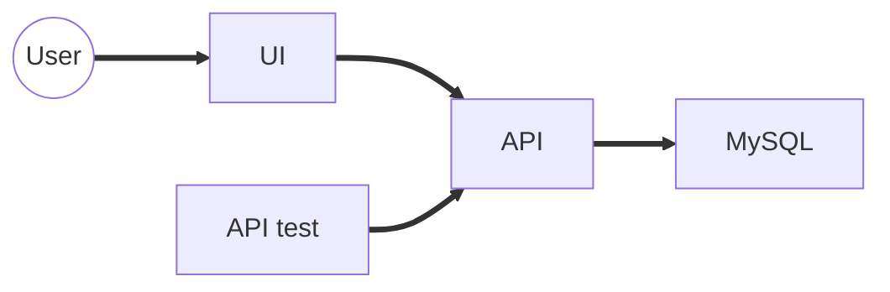

# Ubipong Ecosystem

This contains the Docker compose configurations to run the Ubipong system,
including the database, REST API, and UI.  However, we still have to use the
real challonge.com.  These are the components:

- `mysql`: database for the API
- `ubipong-api`: API of the tournament manager (see <https://github.com/ssung1/ubipong-api>)
- `ubipong-test`: automated testing of the API (see <https://github.com/ssung1/ubipong-test>)
- `ubipong-ui-ng`: UI (plus test) for the tournament manager (see <https://github.com/ssung1/ubipong-ui-ng>)

## System Diagram



## Quick Start

Checkout the components as subdirectories.

Start the MySQL initialization service (this is required to allow login from API)

```sh
docker compose up -d mysql-init
```

Start MySQL

```sh
docker compose up -d mysql
```

Build `ubipong-api`

```sh
docker compose run ubipong-api ./gradlew build
```

Start `ubipong-api`

```sh
docker compose up -d ubipong-api
```

Test with `ubipong-test`

```sh
docker compose up ubipong-test
```

Go to the `ubipong-ui-ng` directory and play with the UI

```sh
cd ubipong-ui-ng
npm start
```

## Services

There are a few categories of services:

- Infrastructure: these include database, messaging, or similar services that
  do not contain much custom code.  Some services (such as Cassandra), can be
  initialized with a script in the same container.  However, some services
  need to be initalized with a separate container, named using the suffix
  `-init`.  They need to be started before their corresponding services are
  started.  The examples include:

  - `mysql-init` and `mysql`
  - `pubsub-init` and `pubsub`

- Development: these are the application we are actively developing.  These
  have the `-dev` suffix and include a shared mount to the host directory where
  the application is.  To start these services, we will need to manually
  check out the application under the subdirectory first.

- Deployment: these are the applications we have built and want to run.  These
  may be built using shared mount.  If so, we need to manually check out and
  build the application.

- Test: these are the tests for the system.  These are like deployment
  services, but we generally want to run it in the foreground using
  `docker compose up {service}`

## Environment

Run 

```bash
docker compose ps
```

to see which environment variables need to be set.

## Start

Choose a service to start.  Some images require checkout 

```bash
docker compose up -d {service}
```

## Stop

```bash
docker compose down --remove-orphans
```
